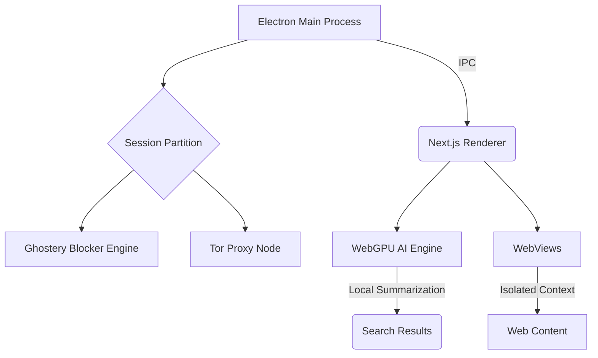

# Veil Browser

<div align="center">
  
  <br/>
  <h3>The Next Generation Privacy-First AI Browser</h3>
  <p>Engineered for maximum security, powered by local AI, and beautifully designed.</p>
</div>

---

## Overview

Veil Browser is a lightweight, futuristic browser built with Electron, Next.js, and React. It brings an unparalleled blend of tracking protection, Tor network integration, and on-device Artificial Intelligence to give you complete control over your web experience.

## Features

- 🛡️ **Built-in Ad & Tracker Blocker**: Powered by the Ghostery engine to stop trackers before they even load.
- 🧅 **Tor Network Integration**: Toggle maximum privacy mode instantly to route your traffic through the Tor network.
- 🧠 **Veil AI (On-Device SLM)**: Automatically summarizes search results and web pages locally using WebGPU-accelerated models, ensuring your data never leaves your device.
- 🪟 **Futuristic Glassmorphism UI**: A stunning, ultra-premium interface with seamless Light and Dark modes.
- 📚 **Reader Mode & Split View**: Distraction-free reading and powerful multitasking.
- 🔐 **Privacy Hardened**: WeBRTC leak protection, fingerprint resistance, and custom Content Security Policies.

## Architecture



## Getting Started

### Prerequisites

- Node.js (v18+)
- npm or yarn

### Installation

1. Clone the repository:
   ```bash
   git clone https://github.com/BGx-11/browser.git
   cd browser
   ```

2. Install dependencies:
   ```bash
   npm install
   ```
   *Note: The `postinstall` script will automatically download the necessary Tor binaries for your platform.*

3. Start the development server:
   ```bash
   npm run dev
   ```

### Building for Production

To create a packaged executable for your operating system:

```bash
npm run pack
# or to create installers
npm run dist
```

## Security Posture

Veil takes a defense-in-depth approach to security:
- **HTTPS-Only Upgrade**: Automatically upgrades insecure connections.
- **Header Stripping**: Removes cross-origin referers and tracking telemetry.
- **Strict IPC**: Context Isolation and Node Integration are strictly enforced.

## Contributing

Contributions are welcome! Please feel free to submit a Pull Request.

## License

MIT License. See `LICENSE` for more information.
