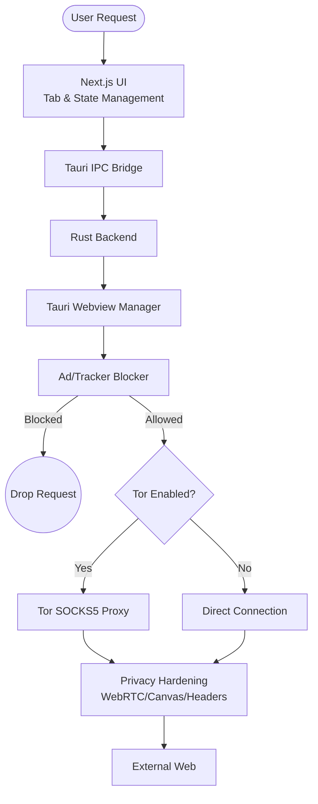

# Veil Browser


**Official Site**: [veil.iambgx.in](https://veil.iambgx.in)

> **Note**: Veil Browser is currently **Windows Only**. macOS and Linux builds are planned for the future.

Veil is an ultra-lightweight, privacy-hardened desktop browser built entirely with **Tauri + Rust + Next.js**. It combines **network-level ad/tracker blocking**, **one-click Tor Network integration**, and a **WebGPU-accelerated on-device AI** that summarizes web pages locally — your data never leaves your machine. Wrapped in a stunning glassmorphism UI with both dark and light themes.

---

> [!CAUTION]
> ### Privacy Notice
> Veil Browser is designed for **personal privacy and security research**. The Tor integration routes traffic through the Tor network for anonymity. Always comply with your local laws and regulations when using privacy tools. The developer assumes no liability for misuse.

---

## 📋 Changelog — v2.0 (Stable)

### 🆕 Features & Updates
| Feature | Description |
|---------|-------------|
| **Tor Connection UI** | Real-time Tor progress indicator and connection status feedback right in the toolbar. |
| **Export/Import Settings** | Sync your privacy controls, speed dials, and configurations seamlessly via local JSON backups. |
| **Accurate Mockups & UI** | Completely overhauled the landing page with a dynamic Aurora background and faster animations. |
| **Enhanced Proxy Layer** | Rust-based CORS filtering added to seamlessly iframe websites via proxy. |
| **Stability Improvements** | Fixed IPC communication bugs on website load and stabilized in-memory history persistence. |

---

## 📋 Changelog — v1.0

### 🆕 Core Features
| Feature | Description |
|---------|-------------|
| **Ultra-Lightweight Core** | Built on Tauri and Rust, producing a blazingly fast ~15MB binary with minimal memory usage. |
| **Hardened Tracker Blocker** | Network-level blocking powered by Ghostery + uBlock Origin Privacy, Badware, and Peter Lowe's lists. Blocks trackers before they load. |
| **Custom Google Search** | Direct Google Scrapers for Rich Media (Images, Videos, Shopping, News). |
| **Tor Network Toggle** | One-click SOCKS5 proxy through the decentralized Tor network for true anonymity |
| **Veil AI (On-Device SLM)** | WebGPU-accelerated local LLM (`Xenova/Qwen1.5-0.5B-Chat`) for page summarization — zero cloud dependency |
| **Reader Mode** | Distraction-free article reading with clean typography |
| **Split View** | Side-by-side tab multitasking |
| **Find in Page** | Fast in-page text search with match highlighting and case sensitivity |
| **Translate** | One-click page translation via Google Translate (12 languages) |
| **Downloads Manager** | Built-in download tracking and file management |
| **Tab Pinning & Drag-and-Drop** | Pin important tabs and reorder via drag-and-drop |
| **Full Keyboard Shortcuts** | Complete set (Ctrl+T, Ctrl+W, Ctrl+F, Ctrl+Shift+T, etc.) |
| **Light & Dark Glassmorphism** | Premium glass UI with smooth theme transitions |
| **Privacy Hardening** | WebRTC leak protection, fingerprint resistance, referer stripping, HTTPS upgrades |

---

## 🏗️ Architecture

Veil is built on a modern multi-process architecture utilizing Tauri and Rust, prioritizing security, privacy, and local execution with minimal resource footprint.



### Rust Backend (Tauri Main Process)
- **App Lifecycle & IPC:** Manages window state, native menus, and blazing-fast IPC commands.
- **Security Layer:**
  - **Tor Daemon Manager:** Spawns and monitors the Tor network process, configuring system proxy routing on demand.
  - **Search Proxy:** Native Rust `reqwest` fetching to bypass CORS and securely scrape rich media without client-side exposure.

### Next.js Renderer (React 19)
- **Tab & Window Management:** Handles complex state for tabs, split view, reader mode, and the resizable sidebar.
- **WebView Container:** Renders web pages in lightweight OS-native webviews (WebView2 on Windows).
- **On-Device AI Engine:** Uses Transformers.js with WebGPU acceleration to run Local Language Models (SLMs) entirely in the browser for page summarization.

---

## 🚀 Setup & Deployment Guide

### Prerequisites
- **Rust** (cargo v1.77+)
- **Node.js** v18+ (v20+ recommended)
- **npm** v9+
- **Git**

### Installation

```bash
# Clone the repository
git clone https://github.com/BGx-11/Veil.git
cd Veil

# Install dependencies
npm install

# Start the Tauri development server
npm run tauri dev
```

### Building for Production

```bash
# Build the highly optimized Tauri executable
npm run tauri build
```

---

## 📁 Project Structure

```
Veil/
├── src-tauri/             # Rust backend and system integration
│   ├── src/
│   │   ├── main.rs        # Tauri entrypoint & IPC Handlers
│   │   └── lib.rs         # Tauri builder and core logic
│   └── Cargo.toml         # Rust dependencies
├── src/
│   ├── app/
│   │   ├── browser/       # Browser shell
│   │   │   └── page.tsx   # Core browser component (1100+ lines)
│   │   ├── page.tsx       # Futuristic landing page for distribution
│   │   ├── globals.css    # Design system & theme tokens
│   │   ├── landing.css    # Landing page styles
│   │   ├── NewTab.tsx     # New tab page with search
│   │   ├── SearchResults  # DuckDuckGo search results renderer
│   │   ├── Settings.tsx   # Settings panel
│   │   ├── SLMPanel.tsx   # AI summary panel
│   │   ├── FindBar.tsx    # Find in page
│   │   ├── Downloads.tsx  # Downloads manager
│   │   ├── History.tsx    # History viewer
│   │   └── ReaderMode.tsx # Reader mode
│   └── lib/
│       └── slm.ts         # AI model pipeline (Transformers.js + WebGPU)
├── public/
│   ├── logo.png           # BGx brand logo
│   └── wasm/              # WebAssembly files for AI
└── package.json
```

---

## ⌨️ Keyboard Shortcuts

| Shortcut | Action |
|----------|--------|
| `Ctrl+T` | New Tab |
| `Ctrl+W` | Close Tab |
| `Ctrl+R` / `F5` | Reload |
| `Ctrl+F` | Find in Page |
| `Ctrl+L` / `F6` | Focus URL Bar |
| `Ctrl+D` | Toggle Bookmark |
| `Ctrl+H` | History |
| `Ctrl+Shift+T` | Reopen Closed Tab |
| `Ctrl+Shift+B` | Toggle Sidebar |
| `Ctrl+Tab` / `Ctrl+Shift+Tab` | Next / Previous Tab |
| `Ctrl+1–9` | Switch to Tab by Index |
| `Alt+←` / `Alt+→` | Back / Forward |
| `F11` | Toggle Fullscreen |

---

## 🤝 Contributing

Contributions, issues, and feature requests are welcome! Feel free to check the [issues page](https://github.com/BGx-11/Veil/issues).

1. Fork the repository
2. Create your feature branch (`git checkout -b feature/amazing-feature`)
3. Commit your changes (`git commit -m 'Add amazing feature'`)
4. Push to the branch (`git push origin feature/amazing-feature`)
5. Open a Pull Request

---

## 📄 License

This project is licensed under the MIT License — see the [LICENSE](LICENSE) file for details.

---

<div align="center">

**Veil Browser Community**  
*Open Source Privacy Initiative*

</div>
